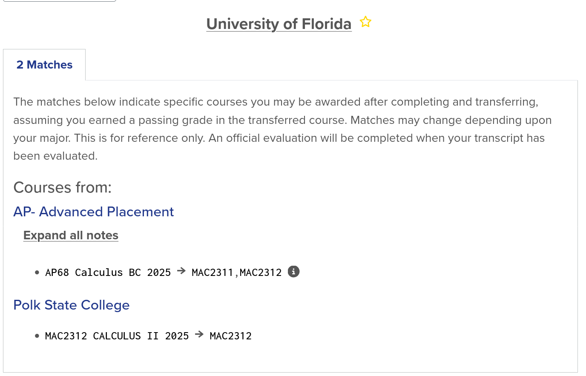

---
title: "Transferability of Dual Enrollment Courses"
date: 2025-11-02
draft: false
description: "A student’s guide to understanding how Dual Enrollment credits transfer, with common cases and policies to look out for."
tags: ["dual enrollment", "college credit", "transfer", "education"]
---

## **Transferability of Dual Enrollment Courses**

Now that you’re officially a Dual Enrollment student, you might wonder: 

> Adrian, this whole dual enrollment thing is all fine and dandy, but what if my college doesn’t even take my credits?

Naturally, it would be quite inefficient to be taking classes you’d earn absolutely zero credit for. Let’s cover some important points you should keep in mind, many of which I use in combination to choose my courses. When analyzing a college’s official website, look out for these:

---

## **Syllabus and Work**

It’s important to keep every syllabus intact, in case a registrar employee wants to review how similar your course was. Nowadays, this shouldn’t be difficult, as most syllabi are just a few clicks away in a Canvas or Blackboard page. 

If you don’t already have sample material from your coursework, you should look back in the LMS archives or reach out to your professor.

---

## **Institutional Credit Limits**

Most colleges and universities set a limit on how many incoming credits you can transfer, which could be from AP exams, CLEP exams, or dual enrollment.  
A common transfer limit for incoming freshmen I’ve seen is 45 credit hours: about 15 courses.

If transfer credits are a priority, watch your credit counts to make sure all can come through safely.

---

## **Credits for Your Major**

If a credit is related to your major, you may want to consider retaking the course in college for a deeper understanding. This is common in health majors, where the skipped courses are bound to sneak up on you later down the line (looking at you, MCAT).

Some institutions will outright reject your credits if they’re mandatory requirements for your major, so it’s important to read policy carefully.

---

## **Reaching Out**

And for the safest way to check if a credit would transfer: sending a quick email!  
It doesn’t need to be Shakespeare-tier, just a concise, brief question.  
Take the below as inspiration:

```
Good afternoon, X Institution Registrar,

I hope you are doing well. I was wondering: would the Y (course code and name) credit from Z Institution transfer as part of a dual enrollment program?

Thank you for your time in advance.

Best,
Your Name
School, Class of 2048
```

---

## **Overlap**

A few months ago you finished your Calculus BC exam and scored a 5 (Pretty nice, right?). But then you ask to transfer a Calculus II credit from your friendly community college.

The registrar employee gives you a confused look, for these are the same credit! You shouldn’t check only how your dual enrollments would transfer, but also the related AP exams you might’ve taken.

---

## **Transferology**

Thankfully, many universities and colleges have begun putting their transfer policies on the **Transferology** website, a page where you can input your coursework and exams to see how they’d carry over.

Let’s see how this would work with the previous Calculus example:



After inputting our MAC2312 course from the *Add Courses* option and the AP Calculus BC exam from the *Standardized Exams* subsection, we can see that these credits would indeed overlap at the University of Florida.

---

## **Conclusion**

Ultimately, your goal should be to keep evidence of your previous coursework, keep credits organized through a transfer spreadsheet, and reach out to make sure your hard work isn’t put to waste. Credit transfer policies are prone to change, so you should never assume your C+ in 1995 College Composition will transfer.
