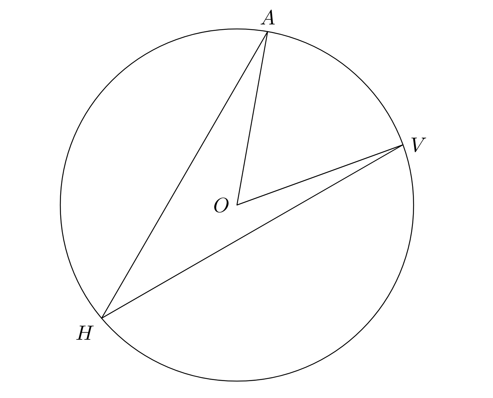
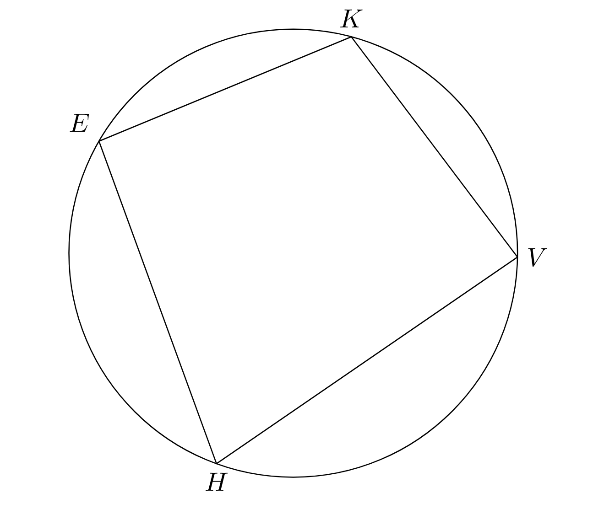

+++
title = "Circles"
description = "Concepts related to circles: arc length, inscribed angles, equations, and more"
date = 2023-07-22
+++

## Circles

### Definitions
The radius of a circle is defined as the distance to the center of a circle. The circumference of a circle is the length around a circle: the perimeter of a circle. A chord is a line that connects any two points on a circle's circumference. The diameter of a circle is a chord that passes through the center of a circle; it is double the radius.

### What's pi?
The strange looking symbol, \( \pi \), is pi! The famous constant is the ratio of a circle's circumference to its diameter. This means that given a circle's diameter, we can find its circumference (essentially its perimeter) by multiplying its diameter by \( \pi \) (approximately 3.14). The area bounded by a circle is equal to \( \pi r^2 \).

### Arc Measure and Arc Length
Arc measure concerns the measure of an arc's central angle, while arc length concerns arcs' length. Arcs, such as "major arc \( \overset{\frown}{AHV} \)" are portions of the circumference of a circle. Arcs are denoted by the points they pass through, and it is also specified whether an arc is major or minor, as it will tell you whether to look for the smaller or larger arc.

See the circle below for a circle with radius of 2 and a central angle of \( 90^\degree \). Since the radius is 2, the diameter is 4, which means the circumference of the full circle is \( 4\pi \). To find the length of the arc highlighted, we divide the central angle by \( 360^\degree \) to find the portion occupied. Since \( \frac{90}{360} = \frac{1}{4} \), this means that the arc takes up a quarter of the full circumference, \( 4\pi \), so the arc length is \( \pi \). Notice that if we know arc length, we can find arc measure, and vice versa.

  

## Inscribed Angles and Inscribed Shapes
Inscribed angles sound more difficult than they actually are. The general process consists of multiplying or dividing by 2: an inscribed angle's measure is half of the central angle's measure. Look at the diagram below. The measure of \( \angle AHV \) is half of \( \angle AOV \)'s measure.

  

In a cyclic quadrilateral (a four-sided shape in a circle), angles that are diagonal to each other are supplementary. This means that \( \angle E + \angle V = 180^\degree \) and that \( \angle K + \angle H = 180^\degree \).

  

When the hypotenuse of a triangle coincides with the diameter, we can assume that the triangle is a right triangle. The converse also holds true.

### Tangent Lines
When taken in the most literal sense, to be tangent means to touch. A tangent line touches a circle at a point, shown below. A tangent line will always be perpendicular to the radius.

  

### Equation of a Circle
The equation for a circle centered at \( (h,k) \) with a radius of \( r \) is

\[
(x - h)^2 + (y - k)^2 = r^2
\]

When written in that form, it is in standard form, where finding the center and radius isn't difficult. However, sometimes a circle is written in expanded form, where every binomial is expanded. Expanded form is undesirable for finding the important details. To convert to standard form, we must "complete the square." This is best shown with an example.

Consider the circle \( x^2 + y^2 - 14x - 12y + 76 = 0 \). First, we must move all constants to the right side:

\[
x^2 + y^2 - 14x - 12y = -76
\]

Then, rearrange to group \( x \) terms and \( y \) terms:

\[
(x^2 - 14x) + (y^2 - 12y) = -76
\]

We will first complete the square for \( x \) and treat the group as a quadratic. The "perfect square constant" for a quadratic of form \( ax^2 + bx + c \) is equal to \( \left( \frac{b}{2} \right)^2 \). Add this constant to both sides:

\[
(x^2 - 14x + (-7)^2) + (y^2 - 12y) = -76 + (-7)^2
\]

\[
(x^2 - 14x + 49) + (y^2 - 12y) = -27
\]

Now the \( x \) terms can be factored into a perfect square: \( \left( x + \frac{b}{2} \right)^2 \):

\[
(x + \frac{-14}{2})^2 + (y^2 - 12y) = -27
\]

\[
(x - 7)^2 + (y^2 - 12y) = -27
\]

Repeat the previous steps for \( y \):

\[
(x - 7)^2 + (y^2 - 12y + 36) = -27 + 36
\]

\[
(x - 7)^2 + (y^2 - 12y + 36) = 9
\]

\[
(x - 7)^2 + (y - 6)^2 = 9
\]

The circle is now in standard form. Now it is easy to see that the circle is centered at \( (7,6) \) and that the circle has a radius of 3. In summary, we find and add the perfect square constant, and then factor.

---

### Exercises

- Adrian wants to know the area of his clock. He only knows that the minute hand is 8 inches long and extends fully to the minute it points at. In square inches, what is the area of the clock?
- Adrian's sister is an archer. She observes that the target is 3 feet in diameter. To the nearest tenth, what is the area of the target?
- A circle is centered at the origin. The point \( (3,4) \) lies on the circle. What is the radius of the circle?
- A circle of radius 9 is divided into 3 equal arcs. What is the length of each arc?
- A circle with radius 13 is drawn. A triangle with side lengths of 10 and 26 is inscribed inside the circle. What is the perimeter of the inscribed triangle?
- Adrian is throwing a party. He sets up several games for guests to play. Among them are "Tackle-the-Triangle." In the game, blindfolded players must throw a dart at a board and win upon landing on the triangle. The board is circular and has a radius of 5. The board has a triangle inscribed inside of it: this triangle has a hypotenuse of 10 and side length of 6. Given that players' dart-throws are perfectly random and will always lie inside the board, what is the probability that they "tackle the triangle"?
- A circle is bounded by \( x^2 + y^2 - 10x - 10y + 25 = 0 \). The center of the circle is \( (h,k) \) and the radius is \( r \). What is the value of the quotient \( \frac{h+k+r}{3k} \)?
