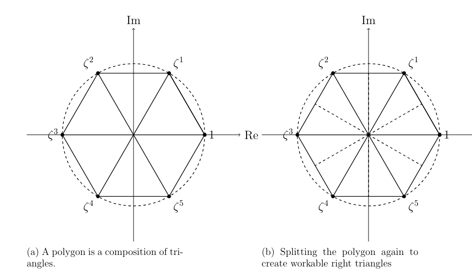
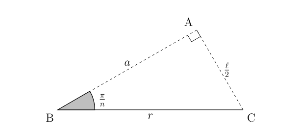
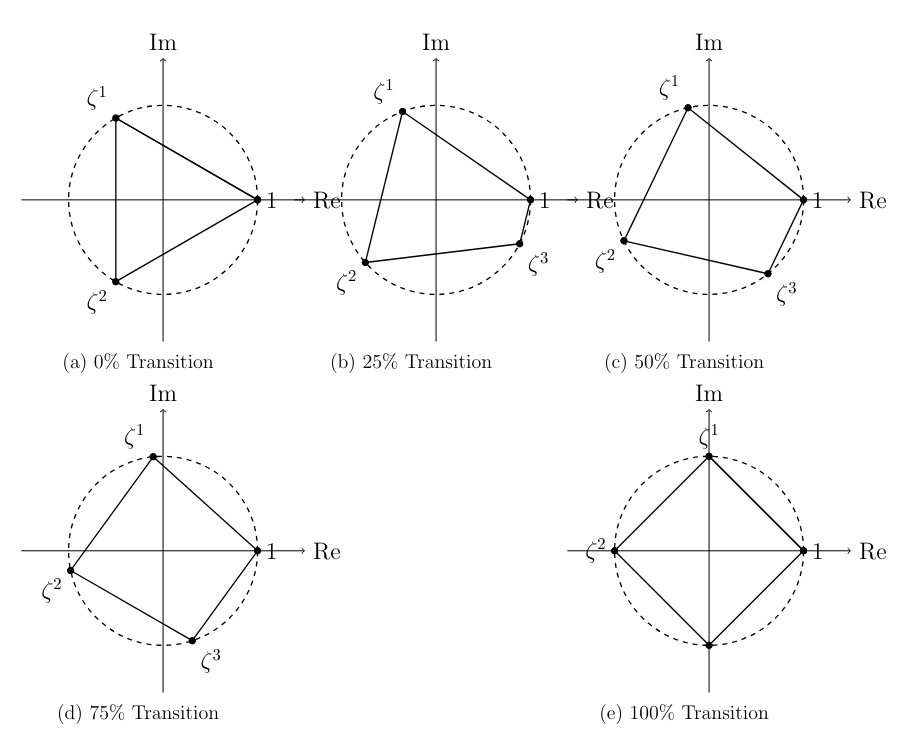

---
title: "Representing Polygons through the Roots of Unity"
date: 2025-07-12
draft: false
description: "Exploring geometric properties of roots of unity and their applications"
tags: ["math", "geometry", "roots of unity"]
---

*Note: this is an excerpt from the ISEF 2025 project.*
# Introduction
It is well known that the "roots of unity" \( x^n=1 \) are equally distributed across a circle. Since the angles formed are equal, connecting the endpoints would create a regular polygon. To graph this figure, we must find an expression for the vertices.

This comes down to solving \( x^n=1 \) generally. Consider the fact that all points are distributed across a circle of \( 2\pi \) radians. If there are \( n \) points, then each one must be \( \frac{2\pi}{n} \) radians away from each other. To then rotate each point into position, utilize the \( \cos \theta + i \sin \theta \) function:

\[
(x_k, y_k) = \left( r \cos \left( \frac{2\pi k}{n} \right), r \sin \left( \frac{2\pi k}{n} \right) \right)
\]

  
*Figure 1: Distinct polygons formed for different values of n*

# Apothem and Side Length
The apothem is defined as the length from the center of the shape to the midpoint of a side. Since all the apothems are equal, it suffices to compute just one apothem. Begin by splitting the polygon into \( n \) equal isosceles triangles. Then, divide each into two triangles with angles of \( \frac{\pi}{n} \). Constructing these triangles would allow us to find both the apothem and polygon side length using trigonometric ratios.

   
*Figure 2: A polygon is a composition of triangles. We can then split the polygon again to create workable right triangles*

  
*Figure 3: Extract a triangle for trigonometric analysis*

Applying basic trigonometric ratios:

\[
\boxed{r\cos\left(\frac{\pi}{n}\right) = a},\quad \boxed{\ell = 2r\sin\left(\frac{\pi}{n}\right)}
\]

The perimeter is then that side length multiplied by \( n \):

\[
\boxed{P=n\ell=2nr\sin\left(\frac{\pi}{n}\right)}
\]

# Computing the Area
The classical formula for polygon area is \( \frac{Pa}{2} \). Since both the perimeter and apothem length have been found, it is now possible to find the total area of the discrete-sided polygon. Plugging in the known perimeter and apothem length, the area is  \( A=nr^2\sin\left(\frac{\pi}{n}\right)\cos\left(\frac{\pi}{n}\right) \). And by using the trigonometric identity \( 2\sin x \cos x = \sin(2x) \), the expression can be turned into:

\[
\boxed{A = \frac{1}{2}nr^2\sin\left(\frac{2\pi}{n}\right)}
\]

# Transition Polygons
For regular polygons, the vertices are equally spaced on the unit circle. However, before using the same coordinate form, we must confirm the rotational structure is preserved. Even if each vertex must be a fraction of a turn, the form can be expressed as:

\[
x_k=re^{i\frac{2\pi k}{n}}
\]

Using Euler's formula, which states \( e^{i\theta}=\cos\theta+i\sin\theta \), the form above becomes:

\[
x_k=r\cos\left(\frac{2\pi k}{n}\right), \quad y_k=r\sin\left(\frac{2\pi k}{n}\right)
\]

Interpolation does not change the structure, so the form is valid. After confirming the form, to find the area enclosed by the interpolated vertices, apply Gauss's area formula.

**Theorem (Gauss's Area Formula):**  
Given a polygon formed by points \( (x_i,y_i) \), the area is:

\[
\frac{1}{2}\left|\sum_{i=1}^{n}x_{i}y_{i+1}-x_{i+1}y_{i}\right|
\]

Substituting \( x_k = r \cos \left(\frac{2\pi k}{n}\right) \) and \( y_k = r \sin \left(\frac{2\pi k}{n}\right) \), we compute:

\[
A = \frac{1}{2} \left| \sum_{k=1}^{n} r^2 \left( \cos \left(\frac{2\pi k}{n}\right) \sin \left(\frac{2\pi (k+1)}{n}\right) - \cos \left(\frac{2\pi (k+1)}{n}\right) \sin \left(\frac{2\pi k}{n}\right) \right) \right|
\]

Using the sine subtraction identity \( \sin(A - B) = \sin A \cos B - \cos A \sin B \), each term simplifies as:

\[
r^2 \left( \cos \left(\frac{2\pi k}{n}\right) \sin \left(\frac{2\pi (k+1)}{n}\right) - \cos \left(\frac{2\pi (k+1)}{n}\right) \sin \left(\frac{2\pi k}{n}\right) \right) = r^2 \sin \left(\frac{2\pi}{n}\right)
\]

Since this term is constant for all \( k \), the sum reduces to:

\[
A = \frac{1}{2} \left| n r^2 \sin \left(\frac{2\pi}{n}\right) \right| = \frac{1}{2} nr^2 \sin \left(\frac{2\pi}{n}\right)
\]

Interestingly, the area formula is the same regardless of whether the polygon is regular or irregular.

# Transition Sample: Triangle to Square

 
*Figure 4: Triangle to square transition phases*

# Extending to Three Dimensions
## Implementation
For regular polyhedrons of Schläfli symbol \( \{p,q\} \), we extend planar root-of-unity constructions to 3D through rotational symmetry. For the dodecahedron \( \{5,3\} \):

1. **Base Polygon Generation**: Initialize a regular pentagon in the \( xy \)-plane using 5th roots of unity
2. **Dihedral Angle Calculation**: 
\[
\theta_d = \arccos\left(-\frac{\sqrt{5}}{5}\right) \approx 116.57^\circ
\]
3. **Edge Selection**: Define axis as polygon edge vector \( \mathbf{e}_{ij} = \mathbf{v}_j-\mathbf{v}_i \)
4. **Axis Normalization**: 
\[
\mathbf{\hat{k}} = \frac{\mathbf{e}_{ij}}{|\mathbf{e}_{ij}|}
\]
5. **Rodrigues Transformation**:
\[
\boxed{\mathbf{v}' = \mathbf{v}\cos\theta + (\mathbf{\hat{k}} \times \mathbf{v})\sin\theta + \mathbf{\hat{k}}(\mathbf{\hat{k}} \cdot \mathbf{v})(1-\cos\theta)}
\]
6. **Iterative Face Generation**:
   - Fix original edge during rotation
   - Apply transformation to non-axis vertices
   - Preserve edge lengths
7. **Structure Propagation**: Repeat rotations about new edges

This methodology preserves:
- Regular polygon faces
- Constant dihedral angles 
- Edge-length preservation

## Algorithm Efficiency

| Algorithm | Time Complexity | Space Complexity |
|-----------|-----------------|------------------|
| Our Method | **O(n)** | O(n) |
| QuickHull | O(n log n) avg. | O(n) |
| Delaunay Triang. | O(n log n) | O(n) |
| Gift Wrapping | O(n h) | O(n) |

*Table 1: Algorithm efficiency comparison*

When implemented in Python with Matplotlib, the algorithm is \( \mathbf{O(n)} \). A segment of the wireframe is shown below.

  
*Figure 6: Three dodecahedron faces generated using algorithm*

# Working in Three Dimensions
## Volume
\[
\boxed{V = \frac{1}{3} \sum_{k=1}^F A_k \cdot \left(\mathbf{c}_k \cdot \mathbf{n}_k\right)}
\]
Where:
- \( A_k \): Area of face \( F_k \)
- \( \mathbf{n}_k \): Unit normal vector
- \( \mathbf{c}_k \): Centroid coordinates

# Conclusions
In this project, we explored the properties of the roots of unity and derived key insights:

- **2D Foundations**:
\[
\begin{aligned}
a &= r \cos\left(\tfrac{\pi}{n}\right), & 
\ell &= 2r \sin\left(\tfrac{\pi}{n}\right) \\
P &= 2nr \sin\left(\tfrac{\pi}{n}\right), & 
A &= \tfrac{1}{2}nr^2 \sin\left(\tfrac{2\pi}{n}\right)
\end{aligned}
\]

- **3D Extensions**:
  - Developed O(n) linear-time polyhedron generation
  - Implemented Rodrigues' rotations for face generation
  - Derived volume and surface area formulas

# References
1. Beutelspacher, Albrecht. *Projective Geometry*. Cambridge University Press, 1998.  
2. Coxeter, H. S. M. *Introduction to Geometry*. 2nd ed. Wiley, 1989.  
3. Coxeter, H. S. M., and S. L. Greitzer. *Geometry Revisited*. MAA Press, 2021. (Original work published 1967)  
4. Martin, George E. *Transformation Geometry*. Springer Science & Business Media, 2012.  
5. Rotman, Joseph J. *A First Course in Abstract Algebra*. 3rd ed. Prentice Hall, 2000.
